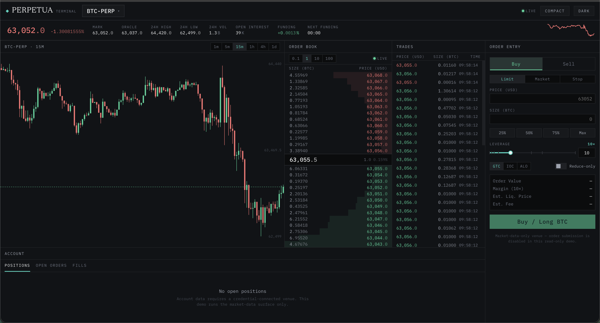

# Perpetua

Headless primitives for pro trading software. A framework-agnostic perp trading client, live venue adapters, and unstyled React components you wire into your own terminal. Perps-first; swap, DEX, and prediction-market verticals reuse the same primitives.



## Why

- **Headless core.** `@perpetua/core` has no DOM, no CSS, no React. Transport, order-book engine, decimal math, and formatters are all pure and tree-shakeable.
- **Exact decimals.** Prices and sizes cross every boundary as strings; arithmetic runs on a scaled-bigint engine, so no float ever touches a price.
- **One contract, many venues.** Adapters implement a single `Venue` interface. Ordering and gap-recovery are the engine's job, not the venue's.
- **Bring your own styling.** React primitives are accessible and unstyled, exposing state through `data-*` attributes and a `--pt-*` token contract you can theme with plain CSS, Tailwind, or MUI.

## Install

```bash
pnpm add @perpetua/core @perpetua/venues @perpetua/react
```

`@perpetua/react` is optional (React 18/19 peer). Core and venues have no UI dependency.

## Usage

### Stream a live order book

```ts
import { createClient, watchOrderBook } from "@perpetua/core";
import { hyperliquid } from "@perpetua/venues/hyperliquid";

const client = createClient({ venue: hyperliquid() });

const markets = await client.market.markets();
const btc = markets.find((m) => m.symbol === "BTC-PERP")!;

const unwatch = watchOrderBook(client, {
  marketId: btc.id,
  depth: 12,
  grouping: btc.tickSize,
  onUpdate: (book) => {
    console.log(book.status, book.mid, book.bids[0], book.asks[0]);
  },
});

// later: unwatch();
```

`watchOrderBook` drives the `BookEngine`: snapshot buffering, sequence-gap resync, derived grouping, imbalance, and flash tagging. `onUpdate` receives a coalesced `BookState` on each frame.

### Subscribe to raw venue feeds

```ts
const off = client.market.subscribe({ kind: "trades", marketId: btc.id }, (event) => {
  if (event.kind === "trades") console.log(event.trades);
});
```

Feeds: `book`, `trades`, `candle`, `markPrice`, `indexPrice`, `funding`, `stats` (capability-gated per venue).

### Render with the React primitives

```tsx
import "@perpetua/react/theme/tokens.css";
import { Num } from "@perpetua/react/components";
import { formatPrice } from "@perpetua/core";

<Num parts={formatPrice("64051.5", { tickSize: "0.1" })} />;
```

Every component styles itself only through `--pt-*` tokens and exposes state as `data-side`, `data-delta`, `data-health`, etc., so any styling system can target it. Density is a first-class token axis (`compact | comfortable`).

## Packages

| Package | Description |
| --- | --- |
| `@perpetua/core` | Headless perp client: transport, actions, `BookEngine`, decimal math, formatters, venue contract. MIT. |
| `@perpetua/venues` | Venue adapters against the core contract. Hyperliquid market data today. MIT. |
| `@perpetua/react` | Unstyled, accessible React primitives plus the theme layer (`tokens.css`, `tailwind.preset.cjs`, `mui-theme.ts`). MIT. |

## Status

Live market data is production-ready end to end (order book, trades, candles, mark/index, funding, stats). Account and write surfaces (positions, orders, fills, order placement) are defined in the contract and land per venue; the Hyperliquid adapter currently ships market data only.

## Example

A full live terminal that dogfoods all three packages against Hyperliquid:

```bash
pnpm install
pnpm build
pnpm --filter @perpetua/example-terminal dev   # http://localhost:5173
```

See [`examples/terminal`](examples/terminal).

## License

MIT.
