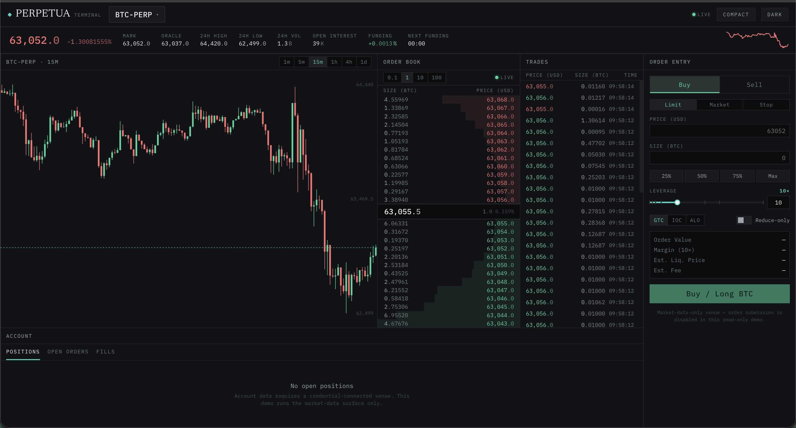

# @perpetua/example-terminal

A live perps terminal that dogfoods the full Perpetua stack against **Hyperliquid**: no auth, read-only market data, real mainnet feeds. It is the reference for how the three packages are meant to compose.



## Run

From a fresh checkout of the repo:

```bash
pnpm install
pnpm build                                     # build core, venues, react
pnpm --filter @perpetua/example-terminal dev   # http://localhost:5173
```

`pnpm --filter @perpetua/example-terminal build` produces a static production bundle; `... preview` serves it.

## How each package is used

- **`@perpetua/core`**: one `createClient({ venue })` shared app-wide (`src/lib/perpetua.ts`), `watchOrderBook` driving the BookEngine, raw `client.market.subscribe` for the other feeds, `fetchCandles` for chart history, `/math` helpers (`marginRequired`, `liqPrice`, `Dec` arithmetic for grouping presets) and `/format` formatters for every number on screen.
- **`@perpetua/venues/hyperliquid`**: live REST + WebSocket market data. The venue is instantiated in exactly one place; swapping exchanges means changing one line.
- **`@perpetua/react`**: unstyled primitives (`Num`, `Delta`, `FlashCell`, `Sparkline`, `SegmentedControl`, `StatusDot`, `DataTable`, `EmptyState`, ...) styled purely through the `--pt-*` token contract in `src/styles.css`. No literal colors outside the tokens; the theme and density toggles in the top bar just set `data-theme` / `data-density` on `<html>` (see [docs/theming.md](../../docs/theming.md)).

## What's wired

| Panel | Source |
|---|---|
| Ticker (mark, 24h change/high/low/vol, OI, funding + countdown, sparkline) | `subscribe` markPrice / stats / funding + candles |
| Chart (candlesticks) | `fetchCandles` history + live `candle` stream |
| Order Book (grouping, depth bars, spread, flash) | `watchOrderBook` → `BookEngine` |
| Trades tape | `subscribe({ kind: "trades" })` |
| Order Entry | primitives + `marginRequired` / `liqPrice` math |
| Account blotter | `EmptyState`: no account venue in this build |

## Layout of the source

```
src/
  lib/perpetua.ts    the one client + venue instance
  lib/format.ts      display helpers over core formatters
  hooks/             thin React wrappers: useMarkets, useOrderBook, useTrades, useTicker, useCandles
  components/        panels: TickerBar, Chart, OrderBook, TradesFeed, OrderEntryPanel, Blotter
  styles.css         all styling, via --pt-* tokens and data-* state selectors
```

The hooks are deliberately boring (`useEffect` + `useState` around a core watcher or subscription) so they can be copied straight into your own app or replaced by your data layer.

## Read-only by design

This Hyperliquid venue ships market data only (`capabilities().credential === null`). Order entry is a fully-derived UI shell with a disabled submit; there is no account/write surface to place a real order.
